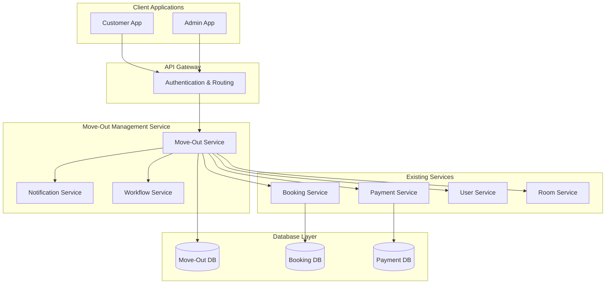

# Design Document

## Overview

The Move-Out Management System is a comprehensive solution that handles tenant departure processes within the MyStayInn platform. The system supports two primary workflows: customer-initiated requests where tenants submit move-out applications for admin approval, and admin-initiated processes for direct tenant management. The design emphasizes workflow automation, proper financial settlement handling, and seamless integration with existing booking and payment systems.

## Architecture

The system follows a microservices architecture pattern integrated with the existing MyStayInn platform:



## Components and Interfaces

### 1. Move-Out Request Component

**Purpose:** Handles customer-initiated move-out requests

**Key Methods:**
- `createMoveOutRequest(customerId, propertyId, requestedDate, reason)`
- `validateNoticeRequirement(requestedDate, noticePeriod)`
- `getMoveOutRequests(adminId, propertyId, status)`
- `updateRequestStatus(requestId, status, adminComments)`

**Data Flow:**
1. Customer submits move-out request through mobile app
2. System validates notice period requirements
3. Request stored with pending status
4. Admin notification triggered
5. Admin reviews and approves/rejects with comments

### 2. Admin Move-Out Processing Component

**Purpose:** Handles admin-initiated move-out processes

**Key Methods:**
- `searchTenants(propertyId, searchCriteria)`
- `initiateMoveOut(tenantId, moveOutDate, reason, adminId)`
- `processScheduledMoveOuts(propertyId, dateRange)`
- `batchProcessMoveOuts(moveOutIds[])`

**Data Flow:**
1. Admin searches for tenant or accesses scheduled move-outs
2. System displays tenant details and current booking info
3. Admin initiates move-out with date and reason
4. System processes immediately or schedules for later

### 3. Security Deposit Settlement Component

**Purpose:** Manages financial settlements during move-out

**Key Methods:**
- `calculateSecurityRefund(bookingId, deductions[])`
- `addDeduction(type, amount, description, evidence)`
- `processRefund(bookingId, refundAmount, method)`
- `generateSettlementSummary(bookingId)`

**Deduction Categories:**
- Cleaning charges
- Damage repairs
- Utility bills
- Late fees/penalties
- Miscellaneous charges

### 4. Status Management Component

**Purpose:** Updates tenant and room statuses throughout the process

**Key Methods:**
- `updateTenantStatus(customerId, status, effectiveDate)`
- `updateRoomStatus(roomId, status, availableDate)`
- `updateBookingEndDate(bookingId, endDate)`
- `triggerAvailabilityUpdate(roomId)`

**Status Transitions:**
- Tenant: active → inactive
- Room: occupied → empty → available
- Booking: active → completed

### 5. Notification Engine Component

**Purpose:** Manages all move-out related communications

**Key Methods:**
- `sendMoveOutRequestConfirmation(customerId, requestDetails)`
- `sendAdminNotification(adminId, requestDetails)`
- `sendStatusUpdateNotification(customerId, newStatus, comments)`
- `sendReminderNotifications(moveOutDate, recipients[])`

**Notification Types:**
- Request submission confirmation
- Status change updates
- Move-out date reminders
- Settlement completion notices

## Data Models

### Move-Out Request Model
```typescript
interface MoveOutRequest {
  requestId: string;           // MOR001234567890
  customerId: string;          // MYS001234567890
  propertyId: string;          // MYP001234567890
  roomId: string;              // R001234567890
  bookingId: string;           // BK001234567890
  
  // Request Details
  requestedDate: Date;
  submissionDate: Date;
  reason: string;
  customerComments?: string;
  
  // Status & Approval
  status: 'pending' | 'approved' | 'rejected' | 'completed';
  adminId?: string;            // MYO001234567890
  adminComments?: string;
  approvalDate?: Date;
  rejectionReason?: string;
  
  // Notice Period Validation
  noticePeriodDays: number;
  isWithinNotice: boolean;
  penaltyAmount?: number;
  
  // Settlement Details
  securityDepositAmount: number;
  deductions: Deduction[];
  finalRefundAmount: number;
  settlementStatus: 'pending' | 'processed' | 'completed';
  
  // Timestamps
  createdAt: Date;
  updatedAt: Date;
  completedAt?: Date;
}
```

### Deduction Model
```typescript
interface Deduction {
  deductionId: string;
  type: 'cleaning' | 'damage' | 'utilities' | 'penalty' | 'miscellaneous';
  amount: number;
  description: string;
  evidence?: string[];         // Photo URLs
  addedBy: string;             // Admin ID
  addedAt: Date;
}
```

### Move-Out Process Model
```typescript
interface MoveOutProcess {
  processId: string;           // MOP001234567890
  type: 'customer_initiated' | 'admin_initiated' | 'scheduled';
  
  // Tenant Information
  customerId: string;          // MYS001234567890
  customerName: string;
  propertyId: string;          // MYP001234567890
  roomId: string;              // R001234567890
  bookingId: string;           // BK001234567890
  
  // Process Details
  moveOutDate: Date;
  actualMoveOutDate?: Date;
  initiatedBy: string;         // Admin ID
  reason: string;
  
  // Status Tracking
  processStatus: 'initiated' | 'in_progress' | 'completed' | 'cancelled';
  tenantStatusUpdated: boolean;
  roomStatusUpdated: boolean;
  settlementCompleted: boolean;
  
  // Financial Settlement
  securityDepositSettlement: SecurityDepositSettlement;
  
  // Timestamps
  createdAt: Date;
  updatedAt: Date;
  completedAt?: Date;
}
```

### Security Deposit Settlement Model
```typescript
interface SecurityDepositSettlement {
  settlementId: string;        // SDS001234567890
  bookingId: string;           // BK001234567890
  originalAmount: number;
  
  // Deductions
  totalDeductions: number;
  deductionBreakdown: Deduction[];
  
  // Refund Details
  finalRefundAmount: number;
  refundMethod: 'bank_transfer' | 'upi' | 'cash' | 'cheque';
  refundStatus: 'pending' | 'processed' | 'completed' | 'failed';
  refundDate?: Date;
  transactionId?: string;
  
  // Documentation
  settlementSummary: string;
  customerAcknowledgment: boolean;
  
  // Timestamps
  createdAt: Date;
  processedAt?: Date;
}
```

## Correctness Properties

*A property is a characteristic or behavior that should hold true across all valid executions of a system-essentially, a formal statement about what the system should do. Properties serve as the bridge between human-readable specifications and machine-verifiable correctness guarantees.*

Now I need to analyze the acceptance criteria to determine which ones are testable as properties. Let me use the prework tool to analyze each acceptance criterion.

### Converting EARS to Properties

Based on the prework analysis, I'll convert the testable acceptance criteria into universally quantified properties, combining related properties to eliminate redundancy.

**Property 1: Notice Period Validation**
*For any* move-out date selection and notice period requirement, the system should correctly validate whether the selected date meets the minimum notice period and flag violations appropriately
**Validates: Requirements 1.2**

**Property 2: Move-Out Request Creation**
*For any* valid move-out request submission, the system should create a request record with pending status and trigger appropriate notifications to both customer and admin
**Validates: Requirements 1.3, 1.4, 6.1**

**Property 3: Notice Period Warning Display**
*For any* move-out date selection within the notice period, the system should display penalty warnings to the customer
**Validates: Requirements 1.5**

**Property 4: Admin Rejection Validation**
*For any* admin rejection attempt, the system should require and validate that a rejection reason is provided before allowing the rejection to proceed
**Validates: Requirements 2.4**

**Property 5: Status Change Notifications**
*For any* move-out request status change, the system should immediately notify the relevant customer with updated status and any admin comments
**Validates: Requirements 2.5, 6.2**

**Property 6: Security Deposit Calculation**
*For any* security deposit with applied deductions, the system should correctly calculate the final refund amount as (original amount - total deductions) and ensure the result is non-negative
**Validates: Requirements 3.3**

**Property 7: Settlement Documentation**
*For any* completed security deposit processing, the system should generate a settlement summary containing all deduction details and final amounts
**Validates: Requirements 3.4**

**Property 8: Deduction Category Tracking**
*For any* deduction added to a move-out process, the system should properly store and categorize it according to the defined deduction types (cleaning, damages, utilities, penalties, miscellaneous)
**Validates: Requirements 3.5**

**Property 9: Tenant Search Results**
*For any* tenant search query that returns matches, all results should include complete current booking details and tenancy information
**Validates: Requirements 4.2**

**Property 10: Admin-Initiated Settlement Processing**
*For any* admin-initiated move-out process, the system should immediately trigger security deposit settlement processing without requiring additional approval steps
**Validates: Requirements 4.5**

**Property 11: Move-Out Date Reminder Notifications**
*For any* move-out date that is 7 days or less in the future, the system should send reminder notifications to both the customer and property admin
**Validates: Requirements 5.2, 6.3**

**Property 12: Comprehensive Status Management**
*For any* confirmed move-out process, the system should update tenant status to inactive, room status to empty, booking end date, and make the room available for new allocations
**Validates: Requirements 5.5, 7.1, 7.2, 7.3, 7.4**

**Property 13: Settlement Completion Notifications**
*For any* completed security deposit processing, the system should notify the customer with detailed settlement information including deductions and final refund amount
**Validates: Requirements 6.4**

**Property 14: Multi-Channel Notification Support**
*For any* notification generated by the system, it should be deliverable through all supported channels (in-app, email, SMS) based on user preferences
**Validates: Requirements 6.5**

**Property 15: Audit Trail Maintenance**
*For any* status change in the move-out process, the system should create and maintain an audit record with timestamp, reason, and responsible party information
**Validates: Requirements 7.5**

**Property 16: Comprehensive Data Persistence**
*For any* move-out request or process, the system should store all required data fields (customer ID, property ID, room ID, dates, status, comments, settlement details) and maintain data integrity throughout the process lifecycle
**Validates: Requirements 8.1, 8.2, 8.3, 8.4**

**Property 17: Move-Out Completion Certification**
*For any* completed move-out process, the system should generate a completion certificate containing all relevant details including tenant information, dates, settlement summary, and admin approval
**Validates: Requirements 8.5**

**Property 18: Analytics and Reporting Accuracy**
*For any* move-out analytics calculation (monthly trends, notice periods, turnover rates), the system should produce accurate results based on the underlying move-out data
**Validates: Requirements 9.2, 9.3, 9.4**

**Property 19: Data Export Functionality**
*For any* move-out data or report, the system should provide successful export functionality in standard formats while maintaining data integrity
**Validates: Requirements 9.5**

**Property 20: System Integration Consistency**
*For any* move-out processing, the system should maintain consistency across all integrated systems by updating booking records, processing refunds through payment system, updating room availability, and syncing tenant status changes
**Validates: Requirements 10.1, 10.2, 10.3, 10.4**

**Property 21: Referential Integrity Maintenance**
*For any* move-out operation that affects multiple data entities, the system should maintain referential integrity across all related records and prevent orphaned or inconsistent data states
**Validates: Requirements 10.5**

## Error Handling

### Validation Errors
- **Invalid Date Selection**: Return clear error messages for dates that violate notice period requirements
- **Missing Required Fields**: Validate all mandatory fields before processing requests
- **Duplicate Requests**: Prevent multiple active move-out requests for the same booking
- **Invalid Status Transitions**: Ensure status changes follow valid workflow paths

### System Integration Errors
- **Payment System Failures**: Implement retry mechanisms and fallback procedures for refund processing
- **Notification Delivery Failures**: Queue failed notifications for retry and provide alternative delivery methods
- **Database Transaction Failures**: Implement rollback mechanisms to maintain data consistency
- **External Service Timeouts**: Handle service unavailability gracefully with appropriate user feedback

### Business Logic Errors
- **Insufficient Security Deposit**: Handle cases where deductions exceed deposit amount
- **Concurrent Modifications**: Prevent race conditions when multiple admins process the same request
- **Invalid Deduction Amounts**: Validate that deductions are positive and don't exceed reasonable limits
- **Room Status Conflicts**: Handle cases where room status changes conflict with existing bookings

## Testing Strategy

### Unit Testing
The system will use unit tests to verify specific examples and edge cases:

- **Date Validation**: Test specific notice period scenarios and edge cases
- **Calculation Logic**: Test security deposit calculations with various deduction combinations
- **Status Transitions**: Test specific workflow state changes and validation rules
- **Integration Points**: Test API calls and data synchronization with external systems

### Property-Based Testing
The system will use property-based testing to verify universal properties across all inputs:

- **Property Test Framework**: Jest with fast-check library for TypeScript/JavaScript
- **Test Configuration**: Minimum 100 iterations per property test to ensure comprehensive coverage
- **Test Tagging**: Each property test tagged with format: **Feature: move-out-management, Property {number}: {property_text}**

**Property Test Examples:**

```typescript
// Property 6: Security Deposit Calculation
test('Security deposit refund calculation', () => {
  fc.assert(fc.property(
    fc.float({min: 1000, max: 50000}), // original deposit
    fc.array(fc.float({min: 0, max: 1000}), {maxLength: 10}), // deductions
    (originalAmount, deductions) => {
      const totalDeductions = deductions.reduce((sum, d) => sum + d, 0);
      const refund = calculateSecurityRefund(originalAmount, deductions);
      
      // Refund should equal original minus deductions, but never negative
      const expectedRefund = Math.max(0, originalAmount - totalDeductions);
      expect(refund).toBe(expectedRefund);
    }
  ));
});

// Property 12: Comprehensive Status Management
test('Move-out status updates', () => {
  fc.assert(fc.property(
    generateMoveOutProcess(), // custom generator
    (moveOutProcess) => {
      const result = processConfirmedMoveOut(moveOutProcess);
      
      // All status updates should occur
      expect(result.tenantStatus).toBe('inactive');
      expect(result.roomStatus).toBe('empty');
      expect(result.bookingEndDate).toBeDefined();
      expect(result.roomAvailableForAllocation).toBe(true);
    }
  ));
});
```

### Integration Testing
- **End-to-End Workflows**: Test complete move-out processes from request to completion
- **System Integration**: Verify proper communication with booking, payment, and notification systems
- **Data Consistency**: Ensure data remains consistent across all system components
- **Performance Testing**: Validate system performance under various load conditions

### Test Data Management
- **Synthetic Data Generation**: Use property-based testing generators for comprehensive test coverage
- **Test Environment Isolation**: Ensure tests don't interfere with production data
- **Cleanup Procedures**: Implement proper test data cleanup to maintain test environment integrity
- **Mock External Services**: Use mocks for external integrations during unit and property testing