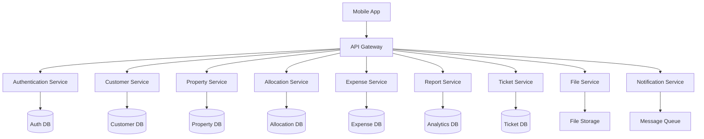

~# API Design Document

## Overview

The MyStayInnAdmin Backend API is a comprehensive RESTful API system designed to manage hostel, PG, and co-living space operations. The system provides secure endpoints for customer management, property configuration, room allocation, expense tracking, reporting, and support ticket management.

The API follows REST architectural principles with JWT-based authentication, implements proper HTTP status codes, and provides consistent JSON responses. The system is designed to be scalable, secure, and maintainable with clear separation of concerns.

## Architecture

### System Architecture



### Technology Stack

- **API Framework**: Node.js with Express.js / Python with FastAPI / Java with Spring Boot
- **Database**: PostgreSQL for relational data, Redis for caching
- **Authentication**: JWT with refresh tokens
- **File Storage**: AWS S3 / Google Cloud Storage
- **Message Queue**: Redis / RabbitMQ for notifications
- **Documentation**: OpenAPI 3.0 specification

## Components and Interfaces

### Base URL Structure

```
Production: https://api.mystay.com/v1
Staging: https://staging-api.mystay.com/v1
Development: https://dev-api.mystay.com/v1
```

### Authentication Endpoints

#### POST /auth/login
Authenticate admin user and return access tokens.

**Request:**
```json
{
  "email": "admin@mystay.com",
  "password": "securePassword123",
  "deviceId": "mobile_device_001"
}
```

**Response:**
```json
{
  "success": true,
  "data": {
    "accessToken": "eyJhbGciOiJIUzI1NiIsInR5cCI6IkpXVCJ9...",
    "refreshToken": "eyJhbGciOiJIUzI1NiIsInR5cCI6IkpXVCJ9...",
    "expiresIn": 3600,
    "user": {
      "id": "admin_123",
      "email": "admin@mystay.com",
      "name": "John Admin",
      "role": "PROPERTY_MANAGER",
      "permissions": ["CUSTOMER_READ", "CUSTOMER_WRITE", "ROOM_ALLOCATE"]
    }
  }
}
```

#### POST /auth/refresh
Refresh access token using refresh token.

#### POST /auth/logout
Invalidate current session tokens.

### Customer Management Endpoints

#### GET /customers/search
Search customers by MyStayInnID or phone number.

**Query Parameters:**
- `query` (required): MyStayInnID or phone number
- `type`: "id" | "phone" | "auto" (default: auto)

**Response:**
```json
{
  "success": true,
  "data": [
    {
      "id": "customer_123",
      "mystayId": "MYS25A123456",
      "name": "Ayush Tripathi",
      "phone": "+917451888545",
      "email": "ayush@email.com",
      "kycStatus": "VERIFIED",
      "enrollmentStatus": "APPROVED",
      "photo": "https://storage.mystay.com/photos/customer_123.jpg",
      "createdAt": "2025-01-15T10:30:00Z"
    }
  ]
}
```

#### GET /customers/{customerId}
Get detailed customer information.

**Response:**
```json
{
  "success": true,
  "data": {
    "id": "customer_123",
    "mystayId": "MYS25A123456",
    "personalInfo": {
      "firstName": "Ayush",
      "lastName": "Tripathi",
      "email": "ayush@email.com",
      "phone": "+917451888545",
      "dateOfBirth": "1998-05-12",
      "photo": "https://storage.mystay.com/photos/customer_123.jpg"
    },
    "documents": {
      "aadhaar": {
        "number": "XXXX XXXX 9012",
        "frontImage": "https://storage.mystay.com/docs/aadhaar_front_123.jpg",
        "backImage": "https://storage.mystay.com/docs/aadhaar_back_123.jpg",
        "verified": true
      },
      "idProof": {
        "type": "DRIVING_LICENSE",
        "frontImage": "https://storage.mystay.com/docs/id_front_123.jpg",
        "backImage": "https://storage.mystay.com/docs/id_back_123.jpg",
        "verified": true
      }
    },
    "emergencyContact": {
      "name": "Rakesh Tripathi",
      "phone": "+919876543210",
      "relationship": "FATHER"
    },
    "kycStatus": "VERIFIED",
    "enrollmentStatus": "APPROVED",
    "roomPreference": "SINGLE",
    "createdAt": "2025-01-15T10:30:00Z",
    "updatedAt": "2025-01-20T14:45:00Z"
  }
}
```

#### GET /customers/enrollments
Get enrollment requests with filtering.

**Query Parameters:**
- `status`: "REQUESTED" | "APPROVED" | "REJECTED"
- `kycStatus`: "PENDING" | "VERIFIED" | "REJECTED"
- `page`: Page number (default: 1)
- `limit`: Items per page (default: 20)
- `search`: Search by name, phone, or MyStayInnID

#### PUT /customers/{customerId}/enrollment-status
Update customer enrollment status.

**Request:**
```json
{
  "status": "APPROVED",
  "reason": "All documents verified successfully",
  "approvedBy": "admin_123"
}
```

### Property Management Endpoints

#### POST /properties
Create a new property configuration.

**Request:**
```json
{
  "basicInfo": {
    "name": "Mahima Panorama",
    "type": "PG",
    "category": "BOYS",
    "address": {
      "line1": "123 Main Street",
      "line2": "Near Metro Station",
      "city": "Bangalore",
      "state": "Karnataka",
      "pincode": "560001",
      "coordinates": {
        "latitude": 12.9716,
        "longitude": 77.5946
      }
    },
    "contactInfo": {
      "phone": "+919876543210",
      "email": "contact@mahimapanorama.com"
    }
  },
  "facilities": {
    "property": ["WIFI", "CCTV", "SECURITY_24X7", "HOT_WATER"],
    "room": ["TABLE_CHAIR", "WARDROBE", "ATTACHED_BATH", "AC"],
    "hasParking": true,
    "foodAvailable": true
  },
  "configuration": {
    "totalFloors": 3,
    "avgRoomsPerFloor": 4,
    "noticePeriod": 30,
    "securityDeposit": 10000,
    "pricingMode": "MONTHLY"
  },
  "sharingOptions": {
    "SINGLE": { "enabled": true, "basePrice": 12000 },
    "DOUBLE": { "enabled": true, "basePrice": 10000 },
    "TRIPLE": { "enabled": true, "basePrice": 8500 }
  }
}
```

#### GET /properties/{propertyId}
Get complete property configuration.

#### PUT /properties/{propertyId}
Update property configuration.

#### GET /properties/{propertyId}/rooms
Get all rooms in a property with availability status.

**Response:**
```json
{
  "success": true,
  "data": {
    "totalRooms": 12,
    "availableRooms": 3,
    "occupiedRooms": 9,
    "floors": [
      {
        "floorNumber": 1,
        "floorName": "Ground Floor",
        "rooms": [
          {
            "id": "room_001",
            "number": "001",
            "type": "SINGLE",
            "price": 12000,
            "status": "AVAILABLE",
            "facilities": ["AC", "ATTACHED_BATH", "WARDROBE"],
            "currentOccupant": null
          },
          {
            "id": "room_002",
            "number": "002",
            "type": "DOUBLE",
            "price": 10000,
            "status": "OCCUPIED",
            "facilities": ["AC", "ATTACHED_BATH", "WARDROBE"],
            "currentOccupant": {
              "customerId": "customer_123",
              "name": "Ayush Tripathi",
              "moveInDate": "2025-01-15",
              "moveOutDate": "2026-01-15"
            }
          }
        ]
      }
    ]
  }
}
```

### Room Allocation Endpoints

#### POST /allocations
Create a new room allocation.

**Request:**
```json
{
  "customerId": "customer_123",
  "roomId": "room_001",
  "moveInDate": "2025-02-01",
  "moveOutDate": "2026-02-01",
  "rentAmount": 12000,
  "securityDeposit": 10000,
  "payments": {
    "securityDepositPaid": true,
    "firstMonthRent": {
      "amount": 12000,
      "onlinePayment": 8000,
      "cashPayment": 4000,
      "paymentDate": "2025-01-25"
    }
  },
  "allocatedBy": "admin_123"
}
```

**Response:**
```json
{
  "success": true,
  "data": {
    "allocationId": "allocation_456",
    "customerId": "customer_123",
    "roomId": "room_001",
    "moveInDate": "2025-02-01",
    "moveOutDate": "2026-02-01",
    "status": "CONFIRMED",
    "rentAmount": 12000,
    "securityDeposit": 10000,
    "totalAmount": 22000,
    "paidAmount": 22000,
    "balanceAmount": 0,
    "createdAt": "2025-01-25T15:30:00Z"
  }
}
```

#### GET /allocations
Get allocation history with filtering.

#### GET /allocations/{allocationId}
Get detailed allocation information.

#### PUT /allocations/{allocationId}/status
Update allocation status (confirm, cancel, extend).

### Expense Management Endpoints

#### POST /expenses
Add a new expense entry.

**Request:**
```json
{
  "type": "DAILY",
  "category": "MAINTENANCE",
  "subcategory": "PLUMBING",
  "amount": 2500,
  "description": "Fixed bathroom tap in room 101",
  "date": "2025-01-25",
  "paymentMethod": "CASH",
  "vendor": {
    "name": "ABC Plumbing Services",
    "phone": "+919876543210"
  },
  "receipt": "https://storage.mystay.com/receipts/expense_789.jpg",
  "addedBy": "admin_123"
}
```

#### GET /expenses
Get expenses with filtering and pagination.

**Query Parameters:**
- `type`: "DAILY" | "MONTHLY"
- `category`: Expense category
- `startDate`, `endDate`: Date range
- `page`, `limit`: Pagination

#### POST /expenses/staff
Add staff salary/expense.

**Request:**
```json
{
  "staffId": "staff_456",
  "month": "2025-01",
  "salary": {
    "basic": 15000,
    "allowances": 3000,
    "deductions": 500,
    "netSalary": 17500
  },
  "additionalExpenses": [
    {
      "type": "BONUS",
      "amount": 2000,
      "description": "Performance bonus"
    }
  ],
  "paymentDate": "2025-01-31",
  "paymentMethod": "BANK_TRANSFER"
}
```

### Reports & Analytics Endpoints

#### GET /reports/financial
Get financial summary report.

**Query Parameters:**
- `period`: "MONTHLY" | "QUARTERLY" | "YEARLY"
- `month`: Specific month (YYYY-MM)
- `year`: Specific year

**Response:**
```json
{
  "success": true,
  "data": {
    "period": "MONTHLY",
    "month": "2025-01",
    "summary": {
      "totalCollections": 85000,
      "totalExpenses": 45000,
      "pendingDues": 25000,
      "netProfit": 40000
    },
    "collections": {
      "rentCollections": 75000,
      "securityDeposits": 10000,
      "onlinePayments": 68000,
      "cashPayments": 17000
    },
    "expenses": {
      "maintenance": 12000,
      "utilities": 8000,
      "staffSalaries": 15000,
      "food": 6000,
      "cleaning": 3000,
      "miscellaneous": 1000
    }
  }
}
```

#### GET /reports/occupancy
Get occupancy analytics.

#### GET /reports/transactions
Get transaction report with payment method breakdown.

#### GET /reports/export
Export reports in PDF format.

### Support Ticket Endpoints

#### GET /tickets
Get support tickets with filtering.

**Query Parameters:**
- `status`: "OPEN" | "IN_PROGRESS" | "RESOLVED" | "CLOSED"
- `priority`: "LOW" | "MEDIUM" | "HIGH" | "URGENT"
- `assignedTo`: Admin ID
- `customerId`: Customer ID

#### GET /tickets/{ticketId}
Get detailed ticket information with conversation history.

#### POST /tickets/{ticketId}/messages
Add a message to ticket conversation.

#### PUT /tickets/{ticketId}/status
Update ticket status and assignment.

### File Management Endpoints

#### POST /files/upload
Upload files (documents, images).

**Request:** Multipart form data
- `file`: File to upload
- `type`: "DOCUMENT" | "IMAGE" | "RECEIPT"
- `category`: File category
- `entityId`: Related entity ID
- `entityType`: "CUSTOMER" | "PROPERTY" | "EXPENSE"

**Response:**
```json
{
  "success": true,
  "data": {
    "fileId": "file_789",
    "filename": "aadhaar_front.jpg",
    "url": "https://storage.mystay.com/docs/file_789.jpg",
    "size": 245760,
    "mimeType": "image/jpeg",
    "uploadedAt": "2025-01-25T16:45:00Z"
  }
}
```

#### GET /files/{fileId}
Get file metadata and secure download URL.

#### DELETE /files/{fileId}
Delete a file (soft delete with audit trail).

### Admin Profile Endpoints

#### GET /admin/profile
Get current admin profile information.

#### PUT /admin/profile
Update admin profile.

#### POST /admin/profile/photo
Upload profile photo.

#### PUT /admin/password
Change password with current password verification.

## Data Models

### Customer Model
```json
{
  "id": "string",
  "mystayId": "string",
  "personalInfo": {
    "firstName": "string",
    "lastName": "string",
    "email": "string",
    "phone": "string",
    "dateOfBirth": "date",
    "photo": "string"
  },
  "documents": {
    "aadhaar": {
      "number": "string",
      "frontImage": "string",
      "backImage": "string",
      "verified": "boolean"
    },
    "idProof": {
      "type": "string",
      "frontImage": "string",
      "backImage": "string",
      "verified": "boolean"
    }
  },
  "emergencyContact": {
    "name": "string",
    "phone": "string",
    "relationship": "string"
  },
  "kycStatus": "PENDING | VERIFIED | REJECTED",
  "enrollmentStatus": "REQUESTED | APPROVED | REJECTED",
  "roomPreference": "SINGLE | DOUBLE | TRIPLE | QUADRUPLE",
  "createdAt": "datetime",
  "updatedAt": "datetime"
}
```

### Property Model
```json
{
  "id": "string",
  "basicInfo": {
    "name": "string",
    "type": "PG | HOSTEL | COLIVING",
    "category": "BOYS | GIRLS | MIXED",
    "address": {
      "line1": "string",
      "line2": "string",
      "city": "string",
      "state": "string",
      "pincode": "string",
      "coordinates": {
        "latitude": "number",
        "longitude": "number"
      }
    }
  },
  "facilities": {
    "property": ["string"],
    "room": ["string"],
    "hasParking": "boolean",
    "foodAvailable": "boolean"
  },
  "configuration": {
    "totalFloors": "number",
    "avgRoomsPerFloor": "number",
    "noticePeriod": "number",
    "securityDeposit": "number",
    "pricingMode": "MONTHLY | DAILY"
  },
  "sharingOptions": {
    "SINGLE": { "enabled": "boolean", "basePrice": "number" },
    "DOUBLE": { "enabled": "boolean", "basePrice": "number" }
  }
}
```

### Room Model
```json
{
  "id": "string",
  "propertyId": "string",
  "number": "string",
  "floorNumber": "number",
  "type": "SINGLE | DOUBLE | TRIPLE | QUADRUPLE",
  "price": "number",
  "status": "AVAILABLE | OCCUPIED | MAINTENANCE | RESERVED",
  "facilities": ["string"],
  "capacity": "number",
  "currentOccupants": ["string"],
  "createdAt": "datetime",
  "updatedAt": "datetime"
}
```

### Allocation Model
```json
{
  "id": "string",
  "customerId": "string",
  "roomId": "string",
  "moveInDate": "date",
  "moveOutDate": "date",
  "status": "CONFIRMED | CANCELLED | EXTENDED | COMPLETED",
  "rentAmount": "number",
  "securityDeposit": "number",
  "payments": {
    "securityDepositPaid": "boolean",
    "monthlyPayments": [
      {
        "month": "string",
        "amount": "number",
        "onlinePayment": "number",
        "cashPayment": "number",
        "paymentDate": "date",
        "status": "PAID | PENDING | OVERDUE"
      }
    ]
  },
  "allocatedBy": "string",
  "createdAt": "datetime",
  "updatedAt": "datetime"
}
```

### Expense Model
```json
{
  "id": "string",
  "type": "DAILY | MONTHLY",
  "category": "MAINTENANCE | UTILITIES | STAFF | FOOD | CLEANING | MISCELLANEOUS",
  "subcategory": "string",
  "amount": "number",
  "description": "string",
  "date": "date",
  "paymentMethod": "CASH | ONLINE | BANK_TRANSFER",
  "vendor": {
    "name": "string",
    "phone": "string"
  },
  "receipt": "string",
  "addedBy": "string",
  "createdAt": "datetime"
}
```

Now I'll use the prework tool to analyze the acceptance criteria for correctness properties.

## Correctness Properties

*A property is a characteristic or behavior that should hold true across all valid executions of a system-essentially, a formal statement about what the system should do. Properties serve as the bridge between human-readable specifications and machine-verifiable correctness guarantees.*

### Property 1: Authentication Token Generation
*For any* valid admin credentials, authentication should always return properly formatted JWT tokens with correct expiration times and required claims
**Validates: Requirements 1.1**

### Property 2: Session Expiration Enforcement
*For any* expired session token, all API requests should be rejected with 401 Unauthorized status regardless of the endpoint accessed
**Validates: Requirements 1.2**

### Property 3: Invalid Credential Rejection
*For any* invalid credential combination, authentication should always fail and log the attempt with proper security information
**Validates: Requirements 1.3**

### Property 4: Customer Search Accuracy
*For any* valid MyStayInnID or phone number, search should return all and only the matching customer records from the database
**Validates: Requirements 2.1**

### Property 5: Enrollment Data Persistence
*For any* valid customer enrollment submission, all provided personal details, documents, and KYC status should be stored completely and retrievably
**Validates: Requirements 2.2**

### Property 6: MyStayInnID Format Compliance
*For any* generated MyStayInnID, it should follow the exact format MYS[YY][A-Z][6-digit-number] and be unique across all customers
**Validates: Requirements 2.6**

### Property 7: Property Configuration Storage
*For any* valid property creation request, all basic information, facilities, and floor configurations should be stored completely and accurately
**Validates: Requirements 3.1**

### Property 8: Pricing Mode Conversion Accuracy
*For any* price value, converting between monthly and daily modes should maintain mathematical accuracy (monthly = daily × 30, daily = monthly ÷ 30)
**Validates: Requirements 3.3**

### Property 9: Allocation Verification Validation
*For any* room allocation attempt, only customers with verified KYC status should be allowed to proceed with allocation
**Validates: Requirements 4.1**

### Property 10: Room Double-Booking Prevention
*For any* room and date range combination, attempting to create overlapping allocations should always be prevented with appropriate error messages
**Validates: Requirements 4.6**

### Property 11: Expense Calculation Accuracy
*For any* set of expense records, the total amounts and category-wise breakdowns should always equal the sum of individual expense amounts
**Validates: Requirements 5.5**

### Property 12: Financial Report Calculation Integrity
*For any* financial data set, the calculated profit/loss should always equal total collections minus total expenses
**Validates: Requirements 6.1**

### Property 13: PDF Export Consistency
*For any* report data, PDF export should always generate valid PDF files with complete data representation and proper formatting
**Validates: Requirements 6.5**

### Property 14: Ticket Status Transition Validity
*For any* support ticket, status transitions should only follow valid workflows (Open → In Progress → Resolved → Closed)
**Validates: Requirements 7.2**

### Property 15: File Upload Validation Consistency
*For any* file upload attempt, validation should consistently enforce file type and size restrictions according to configured limits
**Validates: Requirements 8.1**

### Property 16: Document URL Security
*For any* document retrieval request, the returned URL should always include expiration timestamp and become inaccessible after expiry
**Validates: Requirements 8.3**

### Property 17: Enrollment Notification Delivery
*For any* new customer enrollment submission, notification should always be sent to all relevant admin users without duplication
**Validates: Requirements 9.1**

### Property 18: Profile Update Audit Trail
*For any* admin profile update, the system should maintain complete audit trails with timestamps, old values, new values, and user identification
**Validates: Requirements 10.3**

### Property 19: Backup Data Integrity
*For any* backup operation, the backed-up data should be complete, uncorrupted, and exactly match the original data when restored
**Validates: Requirements 11.2**

## Error Handling

### HTTP Status Codes
The API follows standard HTTP status codes:

- **200 OK**: Successful GET, PUT requests
- **201 Created**: Successful POST requests
- **204 No Content**: Successful DELETE requests
- **400 Bad Request**: Invalid request data or parameters
- **401 Unauthorized**: Authentication required or failed
- **403 Forbidden**: Insufficient permissions
- **404 Not Found**: Resource not found
- **409 Conflict**: Resource conflict (e.g., duplicate booking)
- **422 Unprocessable Entity**: Validation errors
- **429 Too Many Requests**: Rate limiting exceeded
- **500 Internal Server Error**: Server-side errors

### Error Response Format
All error responses follow a consistent format:

```json
{
  "success": false,
  "error": {
    "code": "VALIDATION_ERROR",
    "message": "Invalid input data provided",
    "details": [
      {
        "field": "email",
        "message": "Invalid email format"
      }
    ],
    "timestamp": "2025-01-25T16:45:00Z",
    "requestId": "req_123456"
  }
}
```

### Error Categories

1. **Authentication Errors**
   - `AUTH_REQUIRED`: Authentication token missing
   - `AUTH_INVALID`: Invalid or expired token
   - `AUTH_INSUFFICIENT`: Insufficient permissions

2. **Validation Errors**
   - `VALIDATION_ERROR`: Input validation failed
   - `MISSING_REQUIRED_FIELD`: Required field not provided
   - `INVALID_FORMAT`: Data format validation failed

3. **Business Logic Errors**
   - `RESOURCE_NOT_FOUND`: Requested resource doesn't exist
   - `DUPLICATE_RESOURCE`: Resource already exists
   - `BUSINESS_RULE_VIOLATION`: Business rule validation failed

4. **System Errors**
   - `INTERNAL_ERROR`: Unexpected server error
   - `SERVICE_UNAVAILABLE`: External service unavailable
   - `RATE_LIMIT_EXCEEDED`: Too many requests

### Retry Logic
- **Idempotent Operations**: GET, PUT, DELETE operations can be safely retried
- **Non-Idempotent Operations**: POST operations should include idempotency keys
- **Exponential Backoff**: Implement exponential backoff for retry attempts
- **Circuit Breaker**: Implement circuit breaker pattern for external service calls

## Testing Strategy

### Dual Testing Approach
The API system requires comprehensive testing using both unit tests and property-based tests to ensure correctness and reliability.

**Unit Testing**:
- Test specific API endpoints with known inputs and expected outputs
- Validate error handling for edge cases and invalid inputs
- Test authentication and authorization flows
- Verify database operations and data persistence
- Test file upload and download functionality
- Mock external services for isolated testing

**Property-Based Testing**:
- Generate random valid inputs to test universal properties
- Verify data integrity across all operations
- Test mathematical calculations (pricing, financial reports)
- Validate format compliance (MyStayInnID generation)
- Test security properties (authentication, authorization)
- Verify business rule enforcement across all scenarios

**Integration Testing**:
- Test complete user workflows end-to-end
- Verify data consistency across multiple services
- Test external service integrations
- Validate notification delivery systems
- Test backup and recovery procedures

**Performance Testing**:
- Load testing for high-traffic scenarios
- Stress testing for system limits
- Database performance optimization
- API response time validation
- File upload/download performance

**Security Testing**:
- Authentication and authorization testing
- Input validation and sanitization
- SQL injection and XSS prevention
- File upload security validation
- Data encryption verification

### Property-Based Test Configuration
- **Minimum 100 iterations** per property test to ensure comprehensive coverage
- **Test data generators** for realistic data creation (customers, properties, allocations)
- **Invariant checking** for data consistency across operations
- **Round-trip testing** for data serialization/deserialization
- **Boundary testing** for numerical calculations and date ranges

Each property test must reference its corresponding design document property using the format:
**Feature: admin-backend-apis, Property {number}: {property_text}**

### Test Environment Setup
- **Database**: Use containerized PostgreSQL for consistent test environments
- **File Storage**: Mock S3/cloud storage for file operations
- **External Services**: Mock notification services and payment gateways
- **Test Data**: Automated test data generation and cleanup
- **CI/CD Integration**: Automated testing on every code change

The testing strategy ensures that the API system maintains high reliability, security, and performance standards while providing comprehensive coverage of all functional requirements and business rules.~